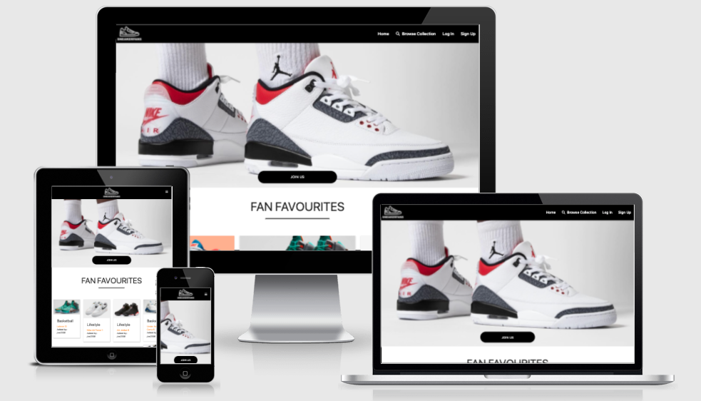

# SNEAKERFANS

This project is based on a database for lovers of sneakers. Around the world sneaker collecting and resale is big business. I created SNEAKERFANS with the aim of drawing this community together and to allow them to create and upload their own favourite sneakers to the website for others to see. I would love to add a posts section in single page layout in the style of facebook and I believe it would unite millions of sneaker lovers around the world. No such site currently exists. This feature could be added on a trial basis for future releases. For now the site is purely a database site that allows users to log in, create data, read data, update data and edit and delete their own data.

There is also the opportunity for businesses to to able to sign up for a fee and access data from a custom dashboard similar to google analytics to see what sneakers are trending and what styles are most popular. This would allow businesses such as store owners to stock up on the most popular brands at the right times of the year and increase their annual sales. For this project time constraints did not allow me to fully explore this option. But it is something I would like to add in the future.

I grew up playing basketball as a teenager in the Michael Air Jordan era of the 1990's. There is no feeling like that of opening a new pair of Air Jordans and to this day decades later I still collect basketball sneakers. 1990s retro releases are my favourites. When I was brainstorming ideas for this milestone project a sneaker database was a no brainer for me. It is a site I would use if it existed and seeing what ideas other users have on sneakers would keep me coming back daily.

I have always loved the simplicity of the Nike website black and white are the main themes and the sneakers do the talking so there are no other distractions or gimmicks. SNEAKERFANS is heavily influenced by the [Nike](https://www.nike.com/ie/) website. 
I did not use any fancy fonts or background colors and opted to use the default sans serif font and white page body with a black navigation bar and footer to see how nice I could make the site while just using the basics. Black and white is the main theme with some dashes of red and orange text. These are prominent themes in some of the most classic sneaker colorways. Such as the holy grail of all retro sneakers The [Air Jordan 3](https://sneakernews.com/wp-content/uploads/2021/05/Air-Jordan-3-Cardinal-2022.jpg)

The website uses HTML and CSS and Javascript in the front end. With my main css framework library being materialize.css and my Javacript framework is jquery cdn. I have also incorporated the use of the font awesome icons cdn for all icons. In the backend flask is used and jinja templating is used to inject data to the HTML. My chosen database is MongoDB.

## [View Live Project](https://ms3-sneakerfans.herokuapp.com/)

## Wireframes:
My initial wireframes and database schemas were sketched on paper and when I was happy I was going in the correct direction I used [Balsamiq](https://balsamiq.com/wireframes/) to finalise my mockups for the front end. For my database schema I used [db diagram](https://dbdiagram.io/). 
The main inspiration for my website is from the global sneaker giant [nike.com](https://www.nike.com/ie/).  All wireframes can be seen in the links below.

* [Home Not Logged In](wireframes/home1.png)
* [Home Logged In](wireframes/home2.png)
* [Browse Collection](wireframes/browse.png)
* [My Sneakers Profile Page](wireframes/profile.png)
* [Add Sneakers](wireframes/add.png)
* [Full Description Page](wireframes/full.png)
* [Log In Page](wireframes/login.png)
* [Log Out Page](wireframes/logout.png)
* [Sign Up Page](wireframes/signup.png)

* [Database Schema](wireframes/schema.png)

# User Stories:
1. **As a fan of new and retro sneakers I am seeking a website that allows me to search sneakers as well as add my own ideas to the website**

2. **As a sneaker collector I would like to add images and descriptions of my collection for others to see**

3. **As the website owner I would like to create a community of sneaker lovers who can share images and information on popular and extremely rare sneakers. I would also like to create a revenue stream to keep growing the site from advertising from sneaker brands**

4. **As a sneaker retailer I would like to log into a website that allows me to see what sneakers are currently fan favourites so we can stock up on popular items to increase profits**

## Strategy:
### What am I making?
A website/app that offers users to sign up/ Login/ Read data from other users/ Write data to the database/ view, edit and delete their own content on their profile page. The site will create a sneaker community while also allowing businesses to see what styles are most popular to increase revenue.

### Website business goals:
1. Create a community of sneakerfans 
1. Allow businesses to sign up for a monthly fee to collect data and feedback on users sneaker preferences 
1. Increase social media and website traffic with the aim of creating revenue from advertising from the major sneaker brands.

### Website target audience:
1. Sneaker lovers and collectors
1. Sneaker resellers
1. Sneaker retailers

### User value:
1. Sneaker lovers and collectors will gain a positive emotional experience from using the site and they can search the entire database to find retro sneakers they had forgotton about that will bring back memories and also encourage them to upload their own favourite sneakers.
1. Retailers and resellers can see exactly what sneakers are the most popular and at what times of the year they need to stock up on popular items to increase their revenue.

### What users can expect:
1. An easy to navigate no fuss website that is pleasant to use.
1. Easy to sign up quickly and begin browsing and adding data to the website.
1. The ability to edit and delete uploads to their own profile.
1. The ability to read and learn about rare sneakers uploaded to the database by other users.

### What is worth doing:
1. A simple sign up form 
1. A simple log in form 
1. A clean profile page
1. A home page that shows 6 random collections from the database so users can see fresh content each time they log in.
1. A simple user edit form 
1. Give users the ability to delete their own data
1. A search box to allow users to enter keywords based on database key values so users can browse the entire database efficiently

### What makes it a good experience:
1. Simple outlay. 
1. clean images placed in materilize image cards of the same heights.
1. Familar simple navigation
1. Lots of great information on rare sneakers 

## Scope:

### Features for this release:
1. Sign up form.
1. Log in form.
1. User edit form. 
1. User delete functionality.
1. Clickable image cards to show full sneaker descriptions
1. Search functionality to browse the entire database.
1. Call to action buttons based on information hierarchy.
1. Social media links.

### User requirements:
1. The ability to read and learn about rare sneakers
1. The ability to create content and add to the website database.
1. The ability to edit content belonging to that user.
1. The ability to delete content belonging to that user.
1. The ability to follow the brand on social media. 
1. The ability to view images.

### How we will achieve these requirements:
1. By adding collections to the mongodb database that the user can access through forms.
1. By adding attractive image cards and simple styling.
1. By implementing appropriate user forms.
1. By implementing access to parts of the site otherwise hidden for non registered users.
1. Appropriate social links in the footer.
1. Using an attractive hero image and branding on the home page and show a selection of fan favourite sneakers.

## Structure:

### Navigation
I have implemented a multi page site. A user must sign up or log in to access certain pages
of the website.
Non account holders may access:
1. Home
1. Browse Collection
1. Log In
1. Sign Up
1. The header also contains the company logo which has a return to home link.

Account holders will gain additonal access to:
1. My Sneakers - (profile page to show all of user's database entries)
1. Add Sneakers - (form to allow user to write to database)
1. Log Out

I have used a fixed navigation bar to allow users to move to any other section from their current section. Navigation has been kept simple and obvious. There are also call to action buttons and text to encourage new visitors to create an account. 

## Skeleton:

### Presentation
1. Simple layout.
1. Hero image on home page.
1. Fixed navigation.
1. Consistent layout and theme.

### User conventional tools:
1. Clear headings. 
1. Clickable elements clearly labelled. 
1. Easy to read nav bar. 
1. Social media links in the form of clickable icons in the footer. 

### Progressive disclosure:
I have placed the priority content on the home page so the user sees this first.
I have arranged the supporting content in order of priority in additional sections. 
Each section links to the most important items to engage users and encourage a conversion
in the form of a new user registering an account.

### Elements that have priority:
1. Navigation menu with fixed scrolling.
1. Clickable logo with return to home link.
1. Image cards of fixed height.
1. Call to action buttons and links to encourage a sign up. 
1. Social media links.

## Surface

### Colors:
The website is inspired by [Nike](https://www.nike.com/ie/). I always loved the simplicity of their website. I set out to try and make the website as enticing as possible while using as little styling as possible. I stuck with the basic sans serif font and white body background. My navbar and footer are also black with white text. The image cards text have some orange colors and sign up links are red. These colors are inspired by both the nike website and one the most iconic sneakers of all time
The [Air Jordan 3](https://sneakernews.com/wp-content/uploads/2021/05/Air-Jordan-3-Cardinal-2022.jpg).

### Fonts:
For all fonts I kept things simple with the default sans serif. I added some underlines to my page headings and the simplicity seems to suit the syle I wanted for the website.

### Images: 
The home page uses a hero image of a pair of Air Jordan Sneakers on feet. The image is clean and
emotive and sets the tone for the website. All other images come from database entries from users. I have created neat materialize cards of fixed height to display all images with continuity. When the image cards are clicked the user is brought to the full sneaker description page where they can view a larger image of the sneaker. I used some box shadow to help this image pop a little. 
I used photoshop to design the company logo.
I also used photoshop for the error handler pages and the are you sure you want to delete modal. 
For these pages I used the Air Jordan Jumpman logo and replaced the basketball with an exclamation
circle icon.

### Order and sequence:
1. Navigation order Not logged in - Home/ Browse Collection/ Log In/ Sign Up
1. Navigation order logged in - Home/ Browse Collection/ My Sneakers/ Add Sneakers/ Log Out
1. Home page order - Hero image/ Call to action/ Heading/ Materialize image cards/ Sign Up link
1. Browse Collection order - Heading/  Search Box/ Materialize image cards
1. Log In order - Heading/ Form/ Username input/ Password input/ Submit button
1. Sign Up order - Heading/ Form/ Username input/ Password input/ Submit button
1. My Sneakers order - Heading/ Add Sneakers button link/ Materialize image cards
1. Add Sneakers order - Heading/ Form/ Choose Category input/ Shoe Name input/ Release Year input/ Shoe Description input/ Image url input/ Submit button
1. Footer section order - Social links/ copyright.

### Other themes:
1. Use of relevant font awesome icons to add a professional touch.
1. Use of subtle shadows to lift some elements off the page.

# AVAILABLE FEATURES

### Navbar
The nav bar is fixed to enhance user experience. All navigation links change color on clicking.
The nav bar is made responsive using materialize.css sidenav-trigger class with javascript initialization.

### Home
The home page is laid out with an eye catching hero image and call to action button to encourage users
to sign up to the website. I have used the mongodb aggregate method to display 6 random images from the database in materialize image cards. The image cards content is injected using the jinja templating language. At the bottom of the home page another internal link guides the user to the sign up form.

### Browse Collection
The browse collection page allows users to view the full sneaker collection whether they are logged in or not. There is the addition of a search bar which allows users to search all documents in the sneakers collection. Allowing non registered users to access this feature will encourage more sign ups to the website as users will be eager to share their sneaker collections and favourites upon seeing what other users have added.

### Login 
A simple login form of user name and password allows users to quickly log into the site. The styling of this form has been kept similar to other competitor sites such as [nike.com](https://www.nike.com/ie/). I have also used an eye and slash eye font awesome icon which are toggled using a javascript function to show and hide the password. I initially had issues displaying the icon in the input field but eventually I solved this with some css. [Credit](https://codepen.io/Sohail05/pen/yOpeBm)

### Sign Up
A simple sign up form of username and password allows users to easily sign up. I have kept this form 
very simple to reduce bounce rates and to encourage new users to sign up without having to verify email links and passwords. As the site's user collection grows I may implement these enhanced security features. I have used the html pattern attribute to ensure certain criteria is met when signing up. I have also used materialize tool tips to clarify all steps of the form to new users.
For added security, when a new user signs up they are directed to the login page to re enter their details instead of being given direct access to the site.

### Profile Page
On successfully signing up and logging in users are directed to their profile page. They are also given a welcome message using the Flask flash() method. I have used javascript to give all flash messages an auto timeout and also the option to manually close. Once users have access to their profile page they can now add their favourite sneakers using a call to action button that is wired to a simple form that writes to the mongodb database. Once a user has added to the database they now have the option to edit and delete everything on their profile page. Users will not have access to edit or delete any other users data.

### Add sneakers
When a use clicks on the add sneakers button they are directed to a form which allows them to pick the category/ add the sneaker name/ add the release year/ A description of the sneaker and add an image url. The user name and date it was added to the database with is taken care of in the backend function. I have used jinja templating to inject all of the database information the user adds to attractive image cards. I have also added a backup feature of using the one-error html attribute to add a back up image in case the image url is broken. Sneaker collectors will find the humour in this back up image as I have used an image from a 1980s Air jordan commercial of a pair of sneakers that were banned by the NBA when they were first released. I used photoshop to add the text "No image available" 

### Edit Sneakers
When a user clicks on the edit button on any of their sneaker additons they are directed to the edit sneakers form which is prepopulated using the objectid from mongodb. They now have the option to edit all input fields on the form and resubmit. Once edits are completed this new information is updated in mongodb and now can be seen on their profile page.

### Delete sneakers
Users have the option to remove any of their entries to mongodb using the delete button. I have used some defensive programming to prevent accidental deletion. To implement this I have used a materialize modal which is triggered with a javascript function. The delete button calls the modal and from here the user is given the options of "are you sure?" and a yes and no button. The yes button triggers my backend python function to remove the data from mongodb. Since the theme of the site is iconic sneakers I used the well known Air Jordan jumpman logo for all warning and error messages. I doctored the logo in photoshop to replace the basketball with a font awesome circle exclamation icon. 

### Mangage Categories
Only admin has access to this page. When admin logs in they are directed to the manage categories page. From here they have the option to add new categories or edit and delete existing categories. I have also used defensive programming to prevent accidental deletion of categories. I have added an if statement in my python functions to check if a category already exists in the database to prevent accidental duplication of categories by user error. Admin also have access to their profile page which allows them to add new sneakers to database directly from the application. I have kept the admin control to only managing categories for now. As the site grows I would like to implement a full admin dashboard which would allow to monitor inappropriate content and edit or delete user data and profiles if it does not meet the criteria of the website.

### Footer
I have added social media links and contact details in the footer. All social media icons are clickable and work in external tabs.
I also added copyright details.

### Features to add for future releases:
There are some features that I would love to implement on future releases:

1. #### Add Comments Likes and Views - The end goal for this site is to create a community of sneaker lovers and collectors. I would like to eventually have a social aspect whereby users can comment on and like other users images. I would also like to collect the amount of likes and views on specific sneakers to allow this data to be shared as an analytics tool for sneaker retailers.
2. #### Retailer dashboard - In order to monetize the site. I would like to add an analytics dashboard that sneaker retailers can pay an annual fee to gain access to. Here they can see what sneakers are trending and what sneakers get the most likes and views during different fashion seasons. This data would help retailers stock up on popular brands while not wasting money on stock that does not sell well. This data will also allow retailers to tailor there sneaker marketing campaigns to the demographics they collect in their analytics dashbars. No user information would be shared from this data.
3. #### User profile dashboard - I would like to add a user dashboard which allows users add a profile photo and some information about themselves and edit as necessary. This is certainly a feature I would add soon.
4. #### Restrict Image type - In order to keep the website nice and clean with no broken images I would like to implement a function in the backend which will only allow data to be written to the database if the image url meets the criteria of jpeg or png. If not the user will be given a message that "this image is not a png or jpeg please try again". I had began researching this option towards the end of the project but unfortunatley I just ran out of time to implement it.
5. #### Admin dashboard - Due to time constraints my admin access is limited to just managing categories. For future releases I would like to add a full admin dashboard which allows to monitor all user and retailer accounts. If user content is deemed inappropriate it can be removed from the site or updated as necessary. Retailer accounts and suscriptions can be kept track of from the admin dashbar.