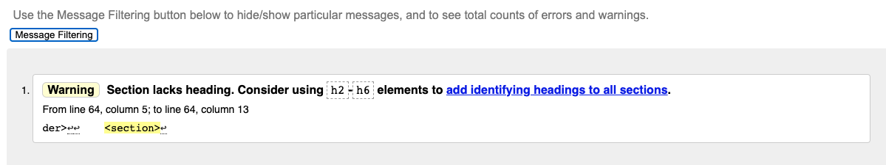
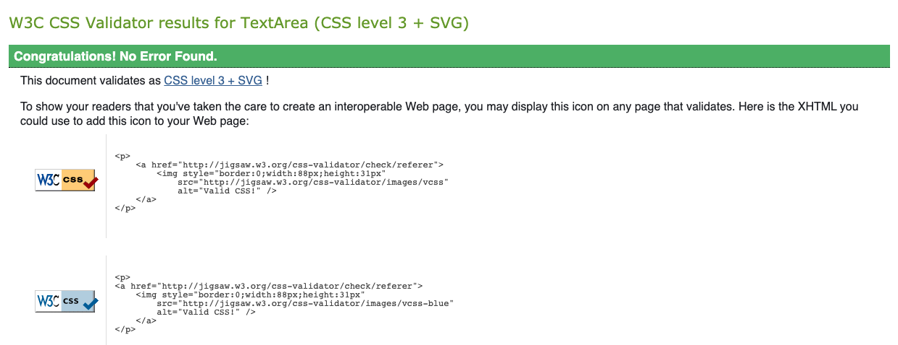
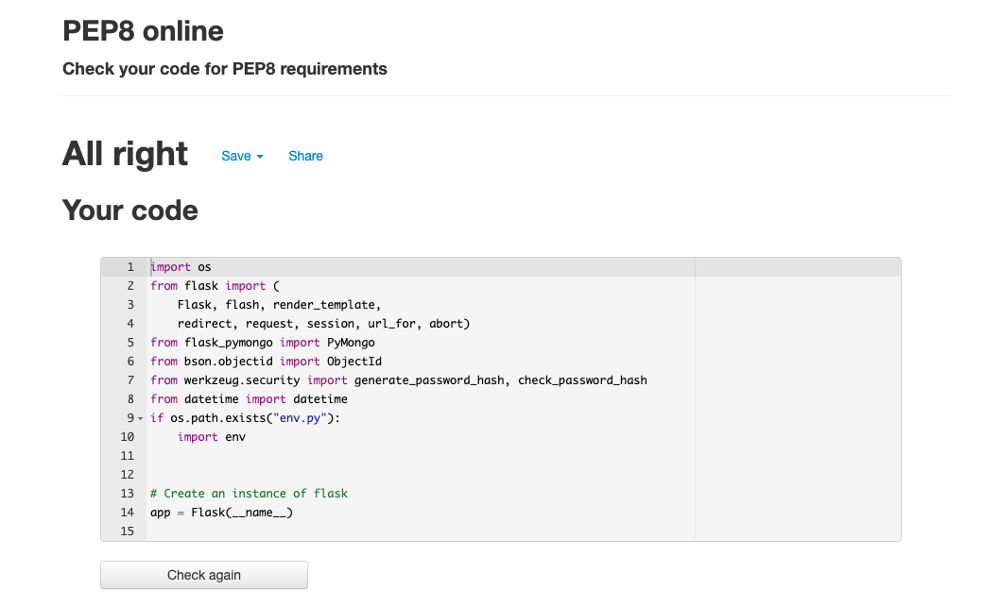
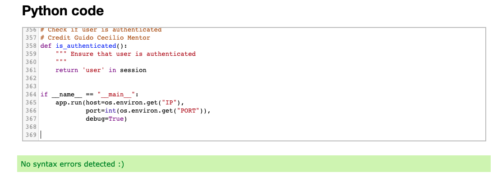
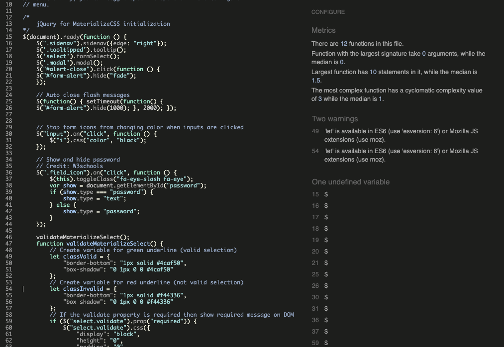
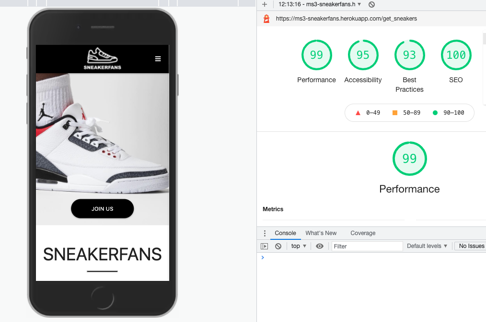
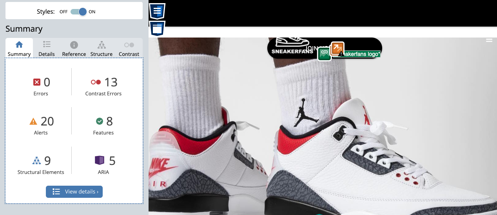
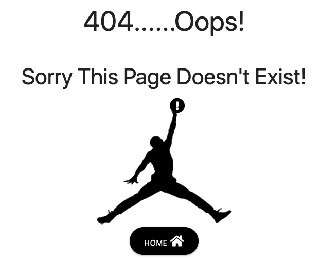
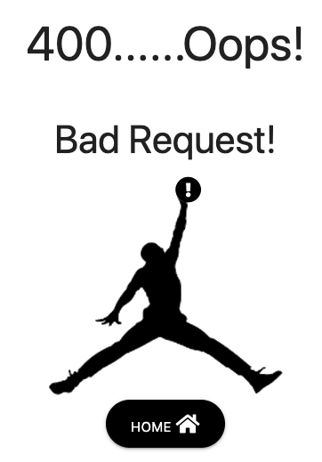
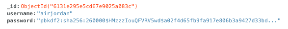

# TESTING.md

# CONTENT QUICK LINKS
## [Users](#user-story-testing)
## [Validation](#code-validation)
## [Manual Tests](#manual-testing)
## [Authenticaton](#user-authentication)
## [Forms](#form-validation)
## [Modals](#modal-testing)
## [CRUD](#crud-testing)
## [Security](#security-features)
## [Bugs](#bugs-test)
## [RETURN TO README](https://github.com/Joe2308/sneakerfans-ms3/blob/main/README.md)

## User story testing:
1. **As a fan of new and retro sneakers** I am looking for a website where I can share my interest in sneakers with other sneaker fans. Having found the SNEAKERFANS website this allows me to do just that. I can use the browse collection search bar to check for all types of sneakers and to give me great ideas for my next purchase.

2. **As a sneaker collector** I am looking for a website where I can find ideas to add my exstensive collection of sneakers. The SNEAKERFANS website allows me to see sneakers I did not realise were realeased. Everything from vintage to signature and retro releases are available to view on SNEAKERFANS. I especially enjoy photographing my own collection and adding them to the database.

3. **As the website owner** I would like to create a community of sneaker lovers who can share images and information on popular and extremely rare sneakers. The website does exactly what it says on the tin. New users are signing up each day and sharing their passion for sneakers. It is easy to sign up and add your sneakers in a matter of minutes

4. **As a sneaker retailer** I created an account with the SNEAKERFANS website. It allows me to see what sneakers people enjoy and it also gives me great ideas for rare releases I can add to my store to stand out from my competitors. I would love if I had a way of seeing what sneakers are trending on the site based on how many views a sneaker has or how many likes it has. I have spoken to the website owner and they have assured me this is a feature they will soon be adding. I would definately pay a suscription for this type of information. It would help me boost sales and stay ahead of the curve.

## **[BACK TO TOP](#content-quick-links)** *

## Code Validation:

### **Html**:

I checked all Html pages using the url from my Heroku application to avoid errors due to jinja templating. I had one error in the html validator which was using the type attribute on an anchor link. Having removed this my Html code passed all validation. The above image is showing a heading error because of flash messaging added to my base.html to extend to all other relevant pages. All Html code was validated using the [W3C HTML validator](https://validator.w3.org/).

### **CSS**:

All CSS code passed using the [W3C CSS validator](https://jigsaw.w3.org/css-validator/).

### **PEP8 Compliance**:

All code was checked for valid indentation, whitespace, blank line space and line length using 
the [PEP8 validator](http://pep8online.com/).

### **Python Syntax**:

All python syntax was validated using the [Python extends class validator](https://extendsclass.com/python-tester.html).

### **Javascript Validation**:

All Javascript code was validated using [Jshint validator](https://jshint.com/). My code passed with no major errors.

## **[BACK TO TOP](#content-quick-links)** *

## Manual Testing:

### Responsive Design: 
For this project I decided to use [Materialize 1.0.0](https://materializecss.com/). Initially I thought of changing back to bootsrap. But the more I used it the more I like the simplicity of Materialize. Its grid system allows for excellent responsive designs. I used [Chrome Developer Tools](https://developers.google.com/web/tools/chrome-devtools) to check how my application was looking on all screen sizes and adjusted as necessary. I had to used minimal media queries in my css code.

### Call to action buttons:
I checked and rechecked all buttons were working on all devices and were leading to the correct sections of the website. It was also important that I laid out 
my CTA choices in order of priorty to my user stories with a button to encourage new visitors to sign up being the most important.

### External links:
I made sure to check that all links and social media links were directed to the correct URLS and also that my target="_blank" attribute was working. 
All external links open in a new browser tab.

### Internal links:
I made sure to check that all interal links were working correctly to ensure to led to the correct destinations and that there were no broken links. I also checked that using browser back and forward buttons did not cause any errors or break the website.

### Lighthouse performance test:

I used Lighthouse in Chrome devtools to test my website's performance.
I increased my SEO scores by adding meta content for seo description.
I also increased my best practises score by adding rel="noreferrer" to all external links.
I found that testing with lighthouse generated higher scores in incognito mode due to browser caching.

### Accessibility:

I used [WAVE web accessibility tool](https://wave.webaim.org/) to make sure the site was accessable to the visually impaired. I also used [a11y](https://color.a11y.com/) to make sure my color contrasts between fonts and backgrounds was acceptable without excessively comprising my vision of the website final design. There were no major errors but some contrast issues. I decided not to change my origional concept as a google lighthouse test gave an accessibility score over 95%.

## **[BACK TO TOP](#content-quick-links)** *

## User Authentication:
I carried out exstensive testing to make sure no user error caused the site to malfunction. To acheieve this I would check all urls available to non logged in and logged in users and manually change them in the browser. I got the following results: 

1. **Changing to a url that does not exists**: 
This gave me a 404 error which lets the user know there is no such page and guides them to the home page. 

2. **Changing a user url to an admin url**:
While logged or authenticated if a user tries to change a url to a url that only admin can access. They are given a warning message that "Only admin can access this page!" The user is guided back to their profile page.

3. **Buttons and links**:
If a user is authenticated when they try to use the sign up buttons and links they will be redirected to their profile page instead of the sign up form

### Object Id validation:
If an Object Id from the database is not valid the user will get a 400 bad request and are guided back to the home page. I tested this by manually changing the object id to an unknown id in the browser search bar. 

### Features Available To Non Registerd Users:
I used jinja if statements in my templates to hide some elements of the navigation bar from non registered users. I manually tested this to make sure everything worked as expected.

### Features Only Available to Admin:
I used jinja if statements to hide some elements of the site from non admin users. I also added user authentication in my back end code to make sure a user could not force their way to admin access. I tested this manually to ensure all worked as expected.

### Users Cannot Access Another Users Profile:
I used jinja if statements to ensure no user could edit or delete another users additions to the webiste database. I manually tested the application to ensure this feature worked as expected.

## **[BACK TO TOP](#content-quick-links)** *

## Form Validation:
* All forms have been checked to ensure they are not sent until the required fields have been included in the requested format. 
* Login forms have been checked to ensure users cannot log in with usernames and passwords that do not match in the database.
* Sign up forms have been checked to ensure new users cannot sign up with an existing username password key value from the database.

## **[BACK TO TOP](#content-quick-links)** *

### Modal Testing
Defensive programming has been used to make sure a user does not delete data by accident. To achieve this all delete buttons have been wired up to modals to ask the user if they are sure they want to delete. Modals have been checked to see if their buttons work logically. The No button closes the modal while the Yes button removes the data from the datbase and redirects the user to the previous page which they came from.

## **[BACK TO TOP](#content-quick-links)** *

## CRUD Testing:
I have inspected the website on all devices to ensure its functionality meets CRUD standards. All users have the ability to Create, Read, Update and Delete content that belongs to them. 
* **Step 1**: Visit site and view data from existing users in the browse collection and home pages.
* **Step 2**: Create an account via the sign up form.
* **Step 3**: Add data to your profile using the add sneakers form. 
* **Step 4**: View your own user data on your profile page.
* **Step 5**: Edit and update your own data using the edit form.
* **Step 6**: Delete your own data using the delete button.

## **[BACK TO TOP](#content-quick-links)** *

## Security Features: 
password hashing has been imported from werkzeug to ensure user security. I have added multiple users to the site and checked that password hashing is working correctly. Below is an image of password hasing in the database. This was a test user and has since been deleted.

## **[BACK TO TOP](#content-quick-links)** *

## Bugs Test:
* I did not have too many major bugs in my testing. Most of the issues I found were related to not querying the database correctly and were successfully fixed by checking on slack and stack overflow.

* One bug that caused me some concern was my delete modal in the admin manage categories section. As there is the option to delete many categories this modal had to be inside the for loop to show categories. When using the modal as normal it would always delete the first category regardless of which category was selected. After asking on slack I found that replacing the modal id with loop.index allowed a unique id to be generated for each modal. I have tested this feature and it is now deleted the correct selected category.

* I have checked the dev tools console and python interperater and there do not appear to any unresolved errors in the application.

## **[BACK TO TOP](#content-quick-links)** *

